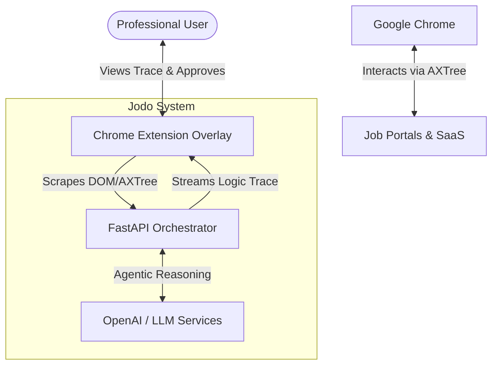

# Jodo Agentic OS - System Architecture

This document describes the high-level architecture and technical decisions behind Jodo, an Agentic Professional OS designed to act as an accessibility middleware layer for the Indian workforce.

## 1. System Context Diagram

## 2. Container Architecture

The system consists of three primary containers:

1. **Chrome Extension (Frontend Injection)**
   - **Role:** Extracts the browser's Accessibility Tree (AXTree) and injects the Jodo Shadow DOM UI over existing web pages.
   - **Tech:** Vanilla JavaScript (ES6), HTML, CSS, Lottie for animations.
   - **Communication:** Maintains a persistent WebSocket connection to the backend to stream live reasoning traces without polling.

2. **Backend Orchestrator (API Engine)**
   - **Role:** The brain of the operation. It manages state, executes the LangGraph workflow, parses the DOM, and interacts with the LLM.
   - **Tech:** Python 3.11+, FastAPI (for WebSockets/HTTP), LangGraph (state machine), LangChain (LLM wrappers).
   - **Communication:** Communicates with the LLM APIs via REST and streams updates to the Chrome Extension via WebSockets.

3. **Public Landing Page (Marketing/Docs)**
   - **Role:** The public face of Jodo, outlining features, explaining the value proposition, and providing installation instructions.
   - **Tech:** Next.js (App Router), React, Tailwind CSS v4.

## 3. Component Deep Dive: Backend Engine

The backend is where the core logic resides, structured around a directed graph representing the agent's workflow.

### 3.1 LangGraph Workflow (`agent.py`)
The orchestrator uses LangGraph to define a cyclic state machine:
- **`analyze_page` node**: Receives the raw Accessibility Tree from the extension and passes it to the LLM to form an `Observation`.
- **`predict_timing` node**: Queries the Lag-Llama forecaster for the optimal interaction window.
- **`generate_trace` node**: The LLM synthesizes the observation, reasoning, and timing to output a structured JSON decision.
- **`execute_action` node**: Emits the final action payload to the WebSocket, allowing the browser extension to interact with the DOM (e.g., clicking a button).

### 3.2 Cognitive Insight Engine (Models)
Located in `models.py`, we use Pydantic to enforce strict structured outputs from the LLM. This prevents hallucinated keys and ensures the Extension always receives exactly:
- `observation`
- `reasoning`
- `decision`
- `action` (e.g., "CLICK", "SCROLL", "TYPE")

### 3.3 AXTree Parser (`ax_parser.py`)
Raw DOM/AXTrees are massive and easily exceed LLM token limits. The `AXParser` acts as a compressor. It strips out non-semantic elements (like pure decorative `
`s), extracts `aria-labels`, roles, and semantic HTML tags (e.g., `<button>`, `<a>`, `<input>`), and generates a token-efficient markdown representation of the page state for the LLM to digest.

## 4. Security & Robustness

- **WebSocket Hardening:** The backend uses strict `allow_origin_regex` in its CORS middleware to only accept WebSocket connections from the specific Chrome Extension or local development environment.
- **Rate Limiting:** In-memory token-bucket rate limiting prevents abuse of the orchestration endpoints.
- **Fault Tolerance:** `try/except` boundaries around all LLM calls and network operations ensure that if a page fails to parse, the agent gracefully recovers and notifies the user via the UI trace rather than crashing the server.
